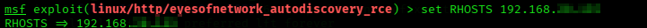

# g0ds-Hand Penetration Testing

## Project Overview

This repository documents a hands-on penetration testing assessment against the intentionally vulnerable **g0ds-Hand** machine, focusing on the **EyesOfNetwork** application.

The assessment covered reconnaissance, service enumeration, vulnerability research, Metasploit exploitation, and post-exploitation verification in a controlled lab environment.

> **Lab / educational use only:** All testing was performed against an intentionally vulnerable lab target in a controlled environment.

## Assessment Details

| Item | Details |
|---|---|
| Target | g0ds-Hand |
| Assessment Type | Internal Network Penetration Test |
| Primary Application | EyesOfNetwork |
| Main Tools | Kali Linux, Nmap, SearchSploit, Metasploit, Meterpreter |
| Risk Rating | High |

## Methodology

1. Network Discovery — `arp-scan -l`
2. Host Verification — `fping`
3. Port and Service Enumeration — `nmap -Pn -A -p-`
4. Web Application Enumeration
5. Vulnerability Research — `searchsploit eyes`
6. Metasploit Initialization — `msfconsole`
7. EyesOfNetwork Module Discovery — `search eye`
8. Exploit Selection and Information Review
9. Target and Local Host Configuration — `RHOSTS` / `LHOST`
10. Exploitation — `exploit`
11. Post-Exploitation Enumeration — `ls` / `pwd`
12. Proof of Access — `getuid`

## Attack Path

```text
Network Discovery
      ↓
Host Verification
      ↓
Nmap Service Enumeration
      ↓
Web Application Review
      ↓
Vulnerability Research
      ↓
Metasploit Module Discovery
      ↓
Exploit Configuration
      ↓
Successful Exploitation
      ↓
Meterpreter Session
      ↓
Post-Exploitation Enumeration
      ↓
Proof of Access
```

## Key Findings

- A vulnerable EyesOfNetwork application was identified.
- Publicly available exploit information was discovered during vulnerability research.
- Remote Code Execution was successfully validated in the controlled lab.
- Post-exploitation commands confirmed access to the target system.

## Evidence

The repository contains the **complete set of assessment screenshots** in the `screenshots/` directory. The README highlights the most important evidence so the attack path can be understood quickly without displaying every screenshot.

### 1. Network Discovery

Initial ARP-based discovery was used to identify active systems on the lab network.


### 2. Port & Service Enumeration

Nmap was used to identify accessible ports and services running on the target.


### 3. Vulnerability Research

SearchSploit was used to research publicly known vulnerabilities related to EyesOfNetwork.


### 4. Exploit Configuration

The relevant Metasploit module was selected and configured for the authorized lab target.



### 5. Successful Exploitation

The exploit was executed and a Meterpreter session was established against the lab target.


### 6. Proof of Access

The `getuid` command was used to identify the account associated with the compromised session and confirm the level of access obtained.


### Full Evidence

All assessment screenshots are available in the [`screenshots/`](screenshots/) directory, including host verification, web application enumeration, Metasploit module discovery, working-directory verification, and the other intermediate steps.

## Tools Used

- Kali Linux
- arp-scan
- fping
- Nmap
- SearchSploit
- Metasploit Framework
- Meterpreter
- Web Browser

## Report

The complete penetration testing report, including the documented assessment evidence, is available here:

[Open the Full Penetration Testing Report](report/g0ds-hand-penetration-testing-report.pdf)

## Recommendations

- Update EyesOfNetwork to a supported and patched version.
- Apply security updates promptly.
- Restrict access to administrative interfaces.
- Implement appropriate network segmentation.
- Perform regular vulnerability assessments.
- Enable centralized logging and monitoring.
- Review web application security configurations periodically.

## Disclaimer

This project was performed in a controlled cybersecurity lab environment for educational and portfolio purposes. Security testing should only be conducted against systems for which explicit authorization has been provided.

## Author

**BELLO OSAGIE FAVOUR**
