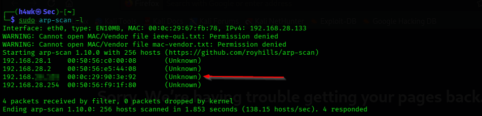
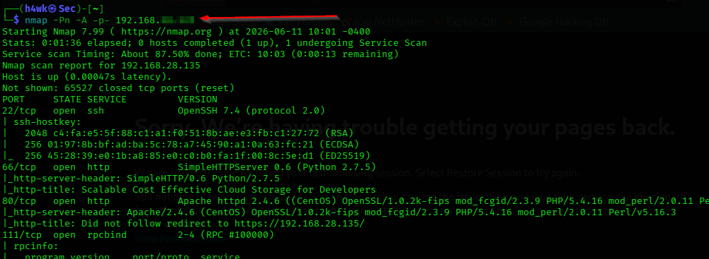
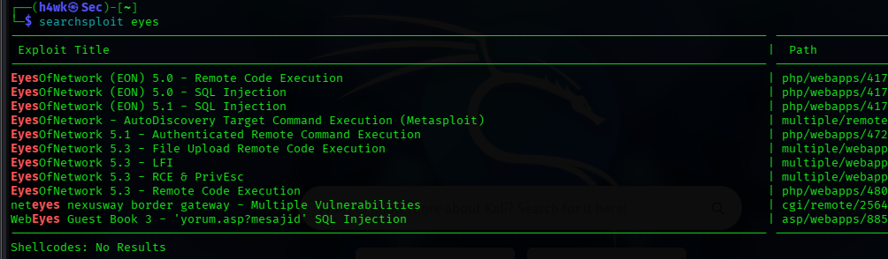
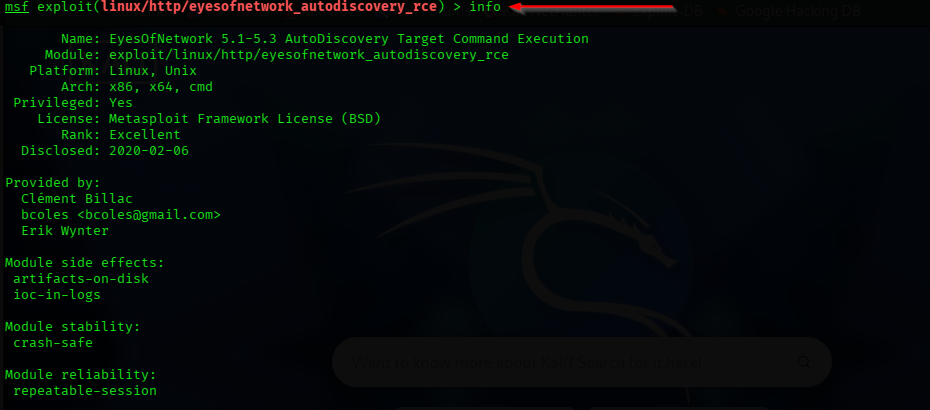
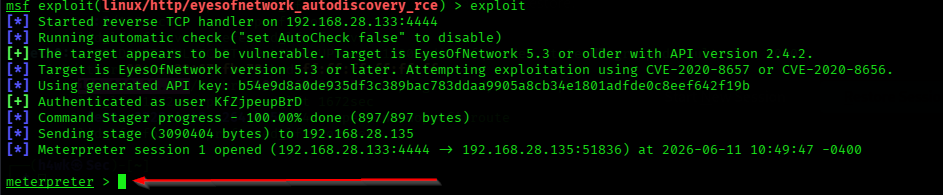
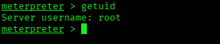

# g0ds-Hand Penetration Testing

## Project Overview

A hands-on penetration testing lab documenting reconnaissance, vulnerability assessment, Metasploit exploitation, and post-exploitation of an **EyesOfNetwork** target.

> **Lab / educational use only:** Testing was performed against an intentionally vulnerable machine in a controlled lab environment.

## Assessment Details

| Item | Details |
|---|---|
| Target | g0ds-Hand |
| Assessment Type | Internal Network Penetration Test |
| Primary Application | EyesOfNetwork |
| Risk Rating | High |

## Methodology

1. Network Discovery — `arp-scan`
2. Host Verification — `fping`
3. Port and Service Enumeration — `nmap`
4. Web Application Enumeration
5. Vulnerability Research — `searchsploit`
6. Metasploit Initialization — `msfconsole`
7. Module Discovery — `search eye`
8. Exploit Selection — `use 16`
9. Module Information Review — `info`
10. Target Configuration — `set RHOSTS`
11. Local Host Configuration — `set LHOST`
12. Exploitation — `exploit`
13. Post-Exploitation Enumeration — `ls`
14. Working Directory Verification — `pwd`
15. Proof of Access — `getuid`

## Tools Used

- Kali Linux
- arp-scan
- fping
- Nmap
- SearchSploit
- Metasploit Framework
- Meterpreter
- Web Browser

## Attack Path

```text
Network Discovery
      ↓
Host Verification
      ↓
Nmap Service Enumeration
      ↓
Web Application Enumeration
      ↓
Vulnerability Research
      ↓
Metasploit Module Discovery
      ↓
Exploit Configuration
      ↓
Successful Exploitation
      ↓
Meterpreter Post-Exploitation
      ↓
Proof of Access
```

## Key Evidence

The README displays the most important evidence from the assessment. The complete screenshot set is available in the [`screenshots/`](screenshots/) directory.

### 1. Network Discovery

ARP-based discovery was used to identify active systems in the lab network.



### 2. Port and Service Enumeration

Nmap was used to identify exposed ports and services running on the target.



### 3. Vulnerability Research

SearchSploit was used to research publicly known vulnerabilities related to the identified EyesOfNetwork application.



### 4. Exploit Configuration

The Metasploit module was reviewed and configured for the authorized lab target.



### 5. Successful Exploitation

The exploit was executed against the intentionally vulnerable lab target, resulting in a Meterpreter session.



### 6. Proof of Access

The `getuid` command was used to verify the account associated with the established Meterpreter session.



## Full Evidence

All 16 assessment screenshots are included in the [`screenshots/`](screenshots/) folder, covering the complete workflow from reconnaissance through proof of access.

## Key Findings

- Vulnerable EyesOfNetwork application identified.
- Publicly available exploit identified during vulnerability research.
- Remote Code Execution was successfully validated in the controlled lab.
- Access to target files was demonstrated during post-exploitation.

## Recommendations

- Update EyesOfNetwork to a supported and patched version.
- Apply security patches promptly.
- Restrict access to administrative interfaces.
- Implement network segmentation where appropriate.
- Perform regular vulnerability assessments.
- Enable centralized logging and monitoring.
- Review web application security configurations periodically.

## Full Report

[View the full penetration testing report](report/g0ds-hand-penetration-testing-report.pdf)

## Disclaimer

This project was performed in a controlled cybersecurity lab environment for educational and portfolio purposes. Testing should only be conducted against systems for which explicit authorization has been provided.

## Author

**BELLO OSAGIE FAVOUR**
